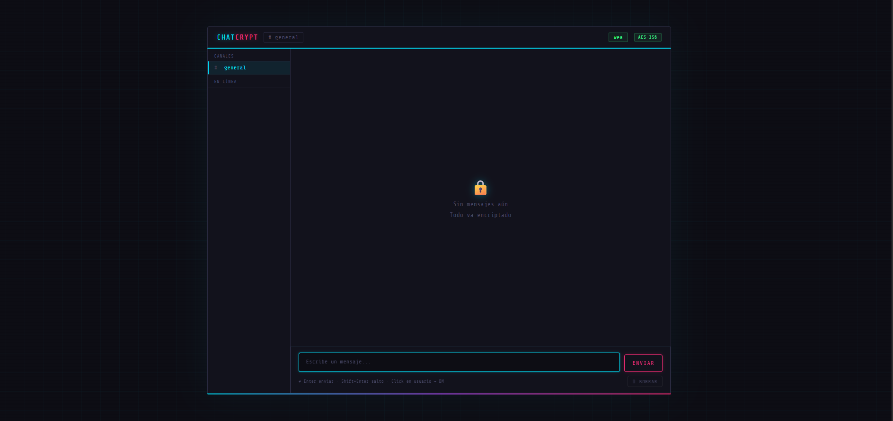

# 🔐 ChatCrypt — Encrypt-Chat

> Real-time chat with **AES-256-CBC** encryption and a **Neon / Lo-Fi** aesthetic


---

## ✨ Features

- 🔒 **AES-256-CBC Encryption** — Every message and username is encrypted before being stored on disk. No one with access to the files can read the content without the key.
- 🎨 **Neon / Lo-Fi Aesthetic** — Dark interface with neon glow effects, monospace typography, and retro scanline animation.
- 👤 **No registration** — Just enter an alias to connect. No passwords, no accounts.
- 💬 **Direct Messages (DM)** — Click on an online user in the sidebar to send them a private message.
- 🟢 **Real-time online users** — The sidebar shows who is active via heartbeats every 8 seconds.
- 🔑 **Configurable encryption key** — Change the `SECRET_KEY` constant directly in the file to use your own password.
- 📜 **Limited history** — A maximum of 200 messages are kept to avoid unnecessary data accumulation.
- 🗑️ **Chat wipe** — Button to clear all messages from the server instantly.
- ⚡ **Single file** — The entire backend and frontend live inside `index.php`. No external dependencies or frameworks.

---

## 📸 Preview

```

```

---

## 🚀 Installation

### Requirements

- PHP 8.0 or higher
- `openssl` extension enabled (enabled by default on most servers)
- A web server with PHP support (Apache, Nginx, Laragon, XAMPP, etc.)

### Steps

**1. Clone the repository**

```bash
git clone https://github.com/Atom1c-B1rd/Encrypt-Chat.git
cd Encrypt-Chat
```

**2. Change the encryption key**

Open `index.php` and edit the constant on line 3:

```php
define('SECRET_KEY', 'YourSecretKeyHere');
```

> ⚠️ **Important:** Use a long, random key. If you change the key after messages have already been saved, existing messages will no longer be decryptable.

**3. Serve the project**

```bash
# With PHP's built-in server (development)
php -S localhost:8000

# Or copy it to your server's folder (XAMPP, Laragon, etc.)
cp -r Encrypt-Chat/ /path/to/htdocs/
```

**4. Open your browser**

```
http://localhost:8000
```

---

## 📁 Project structure

```
Encrypt-Chat/
├── index.php        # The entire application (backend + frontend)
├── messages.json    # Encrypted messages (auto-created)
└── users.json       # Active users (auto-created)
```

---

## ⚙️ Configuration

All options are found at the top of `index.php`:

| Constant | Default value | Description |
|---|---|---|
| `SECRET_KEY` | `'Change This'` | **AES-256 encryption key.** Must be changed. |
| `MESSAGES_FILE` | `messages.json` | Path to the messages file. |
| `USERS_FILE` | `users.json` | Path to the active users file. |
| `MAX_MESSAGES` | `200` | Maximum number of stored messages. |

---

## 🔐 Security

### How encryption works

Each message (text and username) is encrypted individually before being saved:

1. A random **IV (initialization vector)** of 16 bytes is generated per message.
2. **AES-256-CBC** is applied using your `SECRET_KEY`.
3. The result is **Base64-encoded** and stored in `messages.json`.

On read, the process is reversed: the IV is extracted, the data is decrypted, and the message is displayed.

```php
// Encryption
$iv = random_bytes(16);
$encrypted = openssl_encrypt($text, 'AES-256-CBC', SECRET_KEY, 0, $iv);
return base64_encode($iv . '::' . $encrypted);

// Decryption
[$iv, $encrypted] = explode('::', base64_decode($data), 2);
return openssl_decrypt($encrypted, 'AES-256-CBC', SECRET_KEY, 0, $iv);
```

### Considerations

- Messages are stored in JSON files on the server. Make sure `messages.json` and `users.json` are **not publicly accessible** via the browser — add rules to your `.htaccess` or Nginx config if needed.
- This app **has no real authentication**: anyone can type any alias. It is not suitable for sensitive data in production without an additional authentication layer.
- Direct messages (DMs) are filtered on the client side, but are stored encrypted alongside a recipient identifier.

---

## 🎮 Usage

| Action | How |
|---|---|
| Connect | Type your alias and press **Connect** |
| Send a message | Type and press **Send** or `Enter` |
| New line | `Shift + Enter` |
| Send a DM | Click on a user in the sidebar |
| Back to general | Press the **✕** next to the DM target name |
| Wipe chat | 🗑️ button in the bottom-right corner |

---

## 🛠️ Tech stack

- **PHP** — Backend, encryption, and JSON file storage
- **HTML / CSS / Vanilla JS** — Frontend with no dependencies
- **OpenSSL** — AES-256-CBC encryption library
- **Google Fonts** — `Share Tech Mono` + `Space Grotesk`

---

## 📄 License

This project is licensed under the **MIT License**. You are free to use, modify, and distribute it.

---

<div align="center">

Made with 🔐 and neon lights by **[Atom1c-B1rd](https://github.com/Atom1c-B1rd)**

</div>
